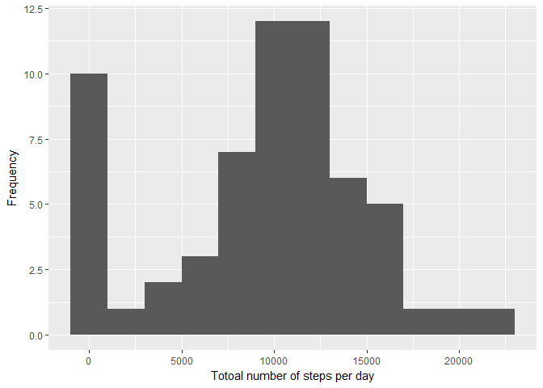
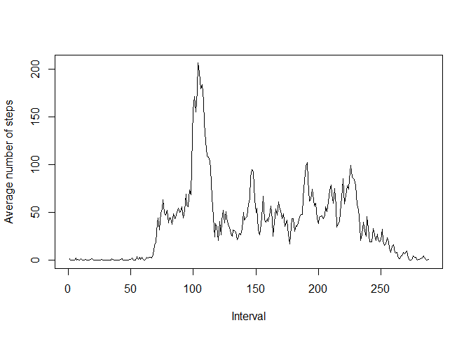
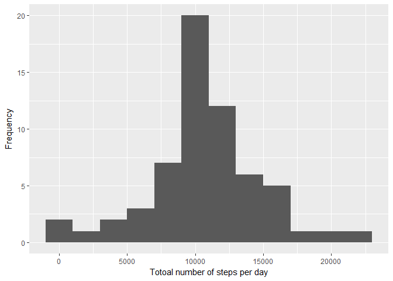
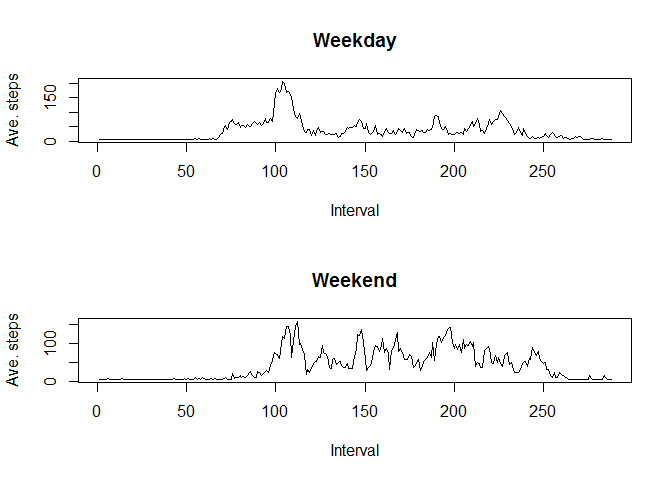

## Loading and preprocessing the data

```r
rm(list = ls())
library("dplyr")
library("tidyr")
library("ggplot2")
data <- read.csv("activity.csv")
```


## What is mean total number of steps taken per day?
1. Histogram of the total number of steps taken each day

```r
step_sum <- data %>% group_by(date) %>% summarise(ssum=sum(steps,na.rm = TRUE))
ggplot(step_sum)+
    geom_histogram(aes(ssum),binwidth = 2000)+
    labs(x="Totoal number of steps per day",y="Frequency")
```

<!-- -->

2. The mean and median of the total number of steps taken per day

```r
step_mean <- data %>% group_by(date) %>% summarise(smean=mean(steps,na.rm = TRUE))
step_mean
```

```
## # A tibble: 61 x 2
##    date         smean
##    <fct>        <dbl>
##  1 2012-10-01 NaN    
##  2 2012-10-02   0.438
##  3 2012-10-03  39.4  
##  4 2012-10-04  42.1  
##  5 2012-10-05  46.2  
##  6 2012-10-06  53.5  
##  7 2012-10-07  38.2  
##  8 2012-10-08 NaN    
##  9 2012-10-09  44.5  
## 10 2012-10-10  34.4  
## # ... with 51 more rows
```

```r
step_median <- data %>% group_by(date) %>% summarise(smedian=median(steps,na.rm = TRUE))
step_median
```

```
## # A tibble: 61 x 2
##    date       smedian
##    <fct>        <dbl>
##  1 2012-10-01     NA 
##  2 2012-10-02      0.
##  3 2012-10-03      0.
##  4 2012-10-04      0.
##  5 2012-10-05      0.
##  6 2012-10-06      0.
##  7 2012-10-07      0.
##  8 2012-10-08     NA 
##  9 2012-10-09      0.
## 10 2012-10-10      0.
## # ... with 51 more rows
```

## What is the average daily activity pattern?
1. Time series plot of the number of steps taken averaged across all days

```r
step_ave <- data %>% 
    group_by(interval) %>%
    summarise(avg=mean(steps,na.rm = TRUE))
plot(step_ave$avg,xlab = "Interval",ylab = "Average number of steps",type="l")
```

<!-- -->

2. The 5-minute interval that, on average, contains the maximum number of steps

```r
step_ave[which.max(step_ave$avg),]
```

```
## # A tibble: 1 x 2
##   interval   avg
##      <int> <dbl>
## 1      835  206.
```

## Imputing missing values
1. Total number of rows with NAs

```r
sum(is.na(data$steps))
```

```
## [1] 2304
```
2. The missing data are replaced by the mean values of the steps for all days 

3. Create a new dataset data_new that is equal to the original dataset but with missing data filled in

```r
data_new <- replace_na(data,list(steps=mean(data$steps,na.rm = TRUE)))
```

4. Plot histogram of the total number of steps taken each day after missing values are imputed

```r
step_sum_new <- data_new %>% group_by(date) %>% summarise(ssum=sum(steps,na.rm = TRUE))
ggplot(step_sum_new)+
    geom_histogram(aes(ssum),binwidth = 2000)+
    labs(x="Totoal number of steps per day",y="Frequency")
```

<!-- -->

The mean and median of the total number of steps taken per day

```r
step_mean_new <- data_new %>% group_by(date) %>% summarise(smean=mean(steps,na.rm = TRUE))
step_mean_new
```

```
## # A tibble: 61 x 2
##    date        smean
##    <fct>       <dbl>
##  1 2012-10-01 37.4  
##  2 2012-10-02  0.438
##  3 2012-10-03 39.4  
##  4 2012-10-04 42.1  
##  5 2012-10-05 46.2  
##  6 2012-10-06 53.5  
##  7 2012-10-07 38.2  
##  8 2012-10-08 37.4  
##  9 2012-10-09 44.5  
## 10 2012-10-10 34.4  
## # ... with 51 more rows
```

```r
step_median_new <- data_new %>% group_by(date) %>% summarise(smedian=median(steps,na.rm = TRUE))
step_median_new
```

```
## # A tibble: 61 x 2
##    date       smedian
##    <fct>        <dbl>
##  1 2012-10-01    37.4
##  2 2012-10-02     0. 
##  3 2012-10-03     0. 
##  4 2012-10-04     0. 
##  5 2012-10-05     0. 
##  6 2012-10-06     0. 
##  7 2012-10-07     0. 
##  8 2012-10-08    37.4
##  9 2012-10-09     0. 
## 10 2012-10-10     0. 
## # ... with 51 more rows
```
Imputing missing data increases the total number of daily steps

## Are there differences in activity patterns between weekdays and weekends?
Panel plot comparing the average number of steps taken per 5-minute interval across weekdays and weekends

```r
data_new <- mutate(data_new,day=ifelse(weekdays(as.Date(data_new$date)) %in% c("Saturday","Sunday"), "Weekend", "Weekday"))

step_Weekdays <- data_new %>% 
    filter(day=="Weekday") %>%
    group_by(interval) %>%
    summarise(avg=mean(steps,na.rm = TRUE))

step_weekends <- data_new %>% 
    filter(day=="Weekend") %>%
    group_by(interval) %>%
    summarise(avg=mean(steps,na.rm = TRUE))

par(mfrow=c(2,1))
plot(step_Weekdays$avg,xlab = "Interval",ylab = "Ave. steps",type="l",main="Weekday")
plot(step_weekends$avg,xlab = "Interval",ylab = "Ave. steps",type="l",main="Weekend")
```

<!-- -->
